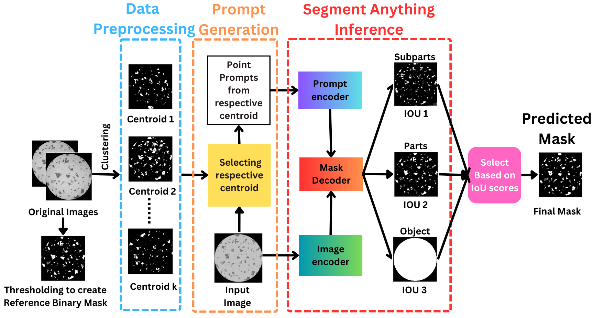

# An unsupervised approach towards promptable porosity segmentation in laser powder bed fusion by segment anything

This repository contains code for the [An unsupervised approach towards promptable porosity segmentation in laser powder bed fusion by segment anything](https://www.nature.com/articles/s44334-025-00021-4)-a novel framework built on top of the Segment Anything Model (SAM). It focuses on **unsupervised prompt generation from the data** to perform **weakly supervised porosity segmentation** without any supervised fine-tuning. The scripts are modular and support different stages of the pipeline such as clustering and segmentation.

##  Framework Overview


##  Repository Contents

| File | Description |
|------|-------------|
| `data_preprocessing_kmeans.py` | Performs unsupervised clustering (K-means) of images of each 3D printed sample. Clusters the data and collects the centroid images. |
| `data_preprocessing_kmeds.py` | Performs unsupervised clustering (K-medoids) of images of each 3D printed sample. Clusters the data and collects the medoid images. |
| `sam_segmentation_gtprompt.py` | Uses pseudo ground truths or reference binary masks to generate prompts for comparing performance with centroid-based prompts. |
| `sam_segmentation_with_setup.py` | Uses the centroid/medoid images to generate prompts, performs SAM inference on the clustered data, and applies predicted IoT score thresholding to collect the most accurate mask. Also computes the Dice Similarity Score. |

##  How to Use

1. **Cluster data and collect centroid images**

   ```bash
   python data_preprocessing_kmeans.py \
      --example_image "/path/to/sample5/set1sample5raw_0000.tif" \
      --data_folder "/path/to/sample5" \
      --output_folder "/path/to/output/Clustered_tiff_images" \
      --centroid_folder "/path/to/output/centroid_images" \
      --threshold_output_folder "/path/to/output/centers" \
      --num_images 50 \
      --n_clusters 3
   ```

   Or to collect medoid images:

   ```bash
   python data_preprocessing_kmeds.py \
      --example_image "/path/to/sample5/set1sample5raw_0000.tif" \
      --data_folder "/path/to/sample5" \
      --output_folder "/path/to/k_meds/Clustered_tiff_images" \
      --medoid_folder "/path/to/k_meds/medoids" \
      --threshold_output_folder "/path/to/k_meds/med_centers" \
      --num_images 50 \
      --n_clusters 3
   ```
## Outputs 
   ```bash
Clustered_tiff_images/ (per sample)
├── cluster_1/
│   ├── image1.tif
│   ├── image2.tif
│   └── ...
├── cluster_2/
│   ├── image3.tif
│   ├── image4.tif
│   └── ...
└── cluster_N/
    └── ...

centroid_folder/               # Centroid (medoid) images saved as PNG
├── medoid_cluster_1.png
├── medoid_cluster_2.png
└── ...

threshold_output_folder/       # Thresholded grayscale versions of centroid images
├── thresholded_medoid_cluster_1.png
├── thresholded_medoid_cluster_2.png
└── ...
 ```


2. **Generate prompts and run SAM on clustered data (to generate masks)**

   ```bash
       python sam_segmentation_with_setup.py \
      --sam_checkpoint "/path/to/sam_vit_h_4b8939.pth" \
      --threshold_mask_path "/path/to/centers/thresholded_centroid_cluster_1.png" \
      --cluster_image_folder "/path/to/cluster_1" \
      --pred_mask_np_folder "/path/to/pred_masks_np_arrays_seg/cluster_1" \
      --pred_mask_final_folder "/path/to/pred_mask_final_seg/cluster_1" \
      --csv_folder "/path/to/CSV" \
      --gt_folder "/path/to/GT/cluster_1" \
      --mask_scores_csv "mask_scores.csv" \
      --dice_csv "dice_scores.csv" \
      --num_points 10000 \
      --score_threshold 0.9 \
      --device cuda \
      --model_type vit_h \
      --auto_install \
      --download_checkpoint_if_missing \
      --create_images_dir
   ```

## Inputs 
   ```bash
centers/
└── thresholded_centroid_cluster_1.png     # Representative Centroid Image of the cluster

cluster_image_folder/
└── cluster_1/                             # Cluster of images to be segmented
    ├── image_1.tif
    ├── image_2.tif
    ├── ...

GT/
└── cluster_1/                             # Ground-truth masks (for evaluation)
    ├── GT_image_1.png
    ├── GT_image_2.png
    ├── ...
## Outputs
pred_mask_final_seg/
└── cluster_1/                             # Final predicted binary masks
    ├── image_1.png
    ├── image_2.png
    ├── ...

CSV/
├── mask_scores.csv                        # Mask index + score for each image
└── dice_scores.csv                        # Dice coefficient evaluation results
 ```
3. **Generate prompts from pseudo ground truth**

   ```bash
   python sam_segmentation_gtprompt.py \
      --sam_checkpoint "/path/to/sam_vit_h_4b8939.pth" \
      --image_folder "/path/to/images" \
      --gt_folder "/path/to/ground_truth" \
      --pred_mask_np_folder "/path/to/output/pred_masks_np" \
      --pred_mask_final_folder "/path/to/output/pred_masks_final" \
      --csv_folder "/path/to/output/csv" \
      --num_points 10000 \
      --score_threshold 0.9 \
      --device cuda \
      --model_type vit_h \
      --mask_scores_csv "mask_scores.csv" \
      --dice_csv "dice_scores.csv" \
      --auto_install \
      --download_checkpoint_if_missing \
      --create_images_dir

   ```
   
 ##Inputs 
    ```bash
 cluster_image_folder/
└── cluster_1/                             # Cluster of images to be segmented
    ├── image_1.tif
    ├── image_2.tif
    ├── ...

GT/
└── cluster_1/                             # Ground-truth masks (for evaluation)
    ├── GT_image_1.png
    ├── GT_image_2.png
    ├── ...
   ```  
 ## Outputs
    ```bash
pred_mask_final_seg/
└── cluster_1/                             # Final predicted binary masks
    ├── image_1.png
    ├── image_2.png
    ├── ...

CSV/
├── mask_scores.csv                        # Mask index + score for each image
└── dice_scores.csv                        # Dice coefficient evaluation results

 ```
> ⚠️ Make sure to configure file paths or parameters in each script based on your data location and clustering setup.


## Core requirements
```bash
    pip install torch numpy opencv-python scikit-learn matplotlib scikit-image pillow
 ```
## SAM installation 
```bash
    pip install git+https://github.com/facebookresearch/segment-anything.git
 ```

## 📄 License

Released under the [MIT License](LICENSE).

##  Author

Maintained by [Israt Zarin Era](https://github.com/IE0005)
